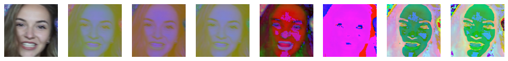
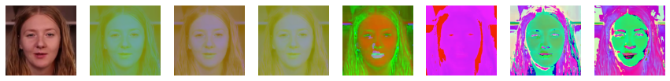
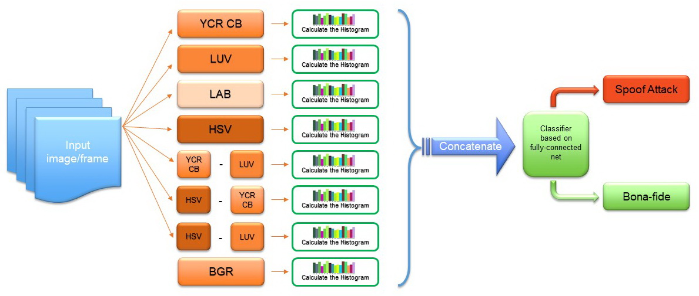

# [The Simple Presentation Attack Detector of Spoofing](https://github.com/AlexDavydov357/The-Simple-Detector-of-Spoofing)

## Overview / Обзор 
 
This repository is dedicated to the image-based Presentation Attack Detection - PAD - system two different kindes: (I) print attack (II) replay attack PAD. The proposed PAD system relies on the combination of few different color spaces and their mutual remainder when subtracted from each other (Fig.1) and uses only a single frame to distinguish the bona fide image from an image attack or video replay, see Fig. 2.

Example1 / Пример1: color space of  spoof image/ цветовое пространство поддельного изображения 
 
Example2 / Пример2: color space of  spoof image/ цветовое пространство поддельного изображения 
 
Example3 / Пример3: color space of  spoof image/ цветовое пространство поддельного изображения 

Этот репозиторий содержит простой детектор спуфинга при распозновании лиц. Система различает два типа аттак: 1. напечатанное изображение 2. воспроизведение видео. Предлагаемая система PAD основана на комбинации нескольких цветовых пространств и их взаимной разности (рис.1). Для распознавания аттаки система использует всего один кадр, чтобы отличить живое изображение от подделки (атаки). Рис.2

